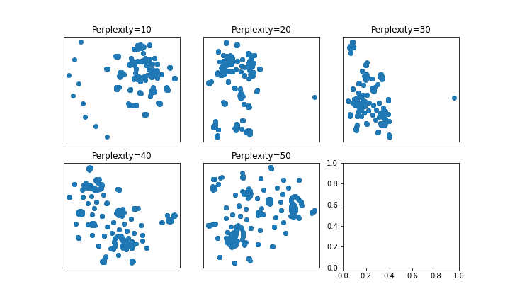
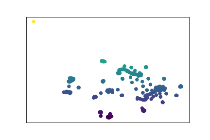
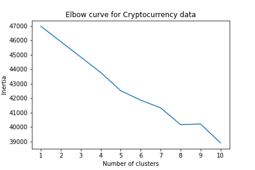

# Clustering analysis - Unsupervised Learning

### Summary

An analysis of cryptocurrencies using clustering algorithms to determine whether similar crpytocurrencies can be grouped to create a classification system.

### Dataset
Dataset was obtained from [Cryptocompare](https://min-api.cryptocompare.com/data/all/coinlist) and can be found in the Resources folder.

### Outline of Prep Steps

* Discarded all cryptocurrencies which are not being traded.
* Removed all rows that have at least 1 null value.
* Filtered for cryptocurrencies that have been mined.
* Removed the coin name as this does not contribute to the analysis.
* Converted categorical data into numerical data using Pandas GetDummies function.
* Scaled/Normalized the data so that large values don't unfairly influence the outcome.

### PCA Dimensionality Reduction

* Used PCA to identify the principal components while preserving 90% of the explained variance.

### t-SNE Analysis
* applied t-SNE to PCA output and created a visually plot of the result to identify if any distinct clusters are visible.

 

### K-Means Clustering 
* Created a K-Means elblow plot to identify the best number of clusters.

### Analysis and Conclusion

Code with analysis and conclusion can be found in the Notebooks folder in the cryptocurrency_clusters.ipynb file.

 
 

 

### Abz Raja
abzraja@gmail.com